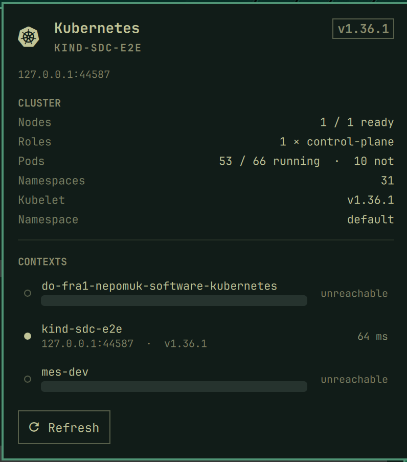

# KubeContext for Omarchy

Shows the active `kubectl` context in the bar, switches between contexts with a
click, and gives a short overview of the selected cluster.



- **Bar** — the current context name next to a Kubernetes icon, so the context
  you are about to run a command against is never a guess.
- **Contexts** — every context in the kubeconfig with its API server, namespace
  and reachability. Click one to switch.
- **Cluster** — nodes ready, roles, pods running, namespaces, server and kubelet
  versions, and average CPU and memory when a metrics server answers.

## Why it stays out of the way

Reading a kubeconfig is a local file operation and costs nothing, so the bar
label follows a context you changed in a terminal within seconds.

Talking to a cluster is the opposite. Clusters fail in more ways than they
succeed — a credential plugin that errors, a private endpoint whose DNS does not
resolve, an API server that simply never answers — and this widget lives inside
the process that draws your desktop. So:

- Nothing leaves the machine while the panel is closed.
- Every call is bounded twice, by `kubectl --request-timeout` and by an outer
  `timeout`, so a dead cluster costs seconds rather than forever.
- Reachability is probed for all contexts in parallel, so the slowest one sets
  the wait instead of the sum of them.
- A cluster that does not answer is reported as unreachable, never as an empty
  cluster with zero nodes and zero pods.

## Requirements

`kubectl` on `PATH` and a readable kubeconfig. Nothing else. If `kubectl` is
missing the panel says so instead of showing an empty list.

## Install

```bash
omarchy plugin add https://github.com/Nepomuk-Software/KubeWidget.git --enable
```

## What it writes

One thing, on an explicit click: `kubectl config use-context <name>`, which sets
`current-context` in your kubeconfig. Every shell you open afterwards inherits
it — that is the point, and it is why it never happens on its own. Everything
else the widget does is read-only.

## Usage

| Where | Action |
|---|---|
| Bar, left | open/close the panel |
| Bar, right or middle | re-read everything now |
| Panel, click a context | switch to it |
| Panel, `r` | refresh |
| Panel, Esc | close |

## Settings

`omarchy bar set io.github.nepomuk-software.kubecontext <key> <value>`

| Key | Default | Effect |
|---|---|---|
| `showContext` | `true` | context name next to the icon; ignored on vertical bars |
| `maxLabel` | `18` | longer names are elided in the bar |
| `contextIntervalSec` | `5` | how often the kubeconfig is re-read (local, no network) |
| `probeIntervalSec` | `30` | how often clusters are contacted while the panel is open |

## IPC

```
omarchy-shell io.github.nepomuk-software.kubecontext <method> [context]
```

| Method | Does |
|---|---|
| `open` `close` `toggle` | the popup |
| `current` | the active context name |
| `use <context>` | switch to a context |
| `refresh` | re-read kubeconfig, probe, fetch the overview |
| `status` | `<context> reachable <version> nodes=r/t pods=r/t ns=n`, or `unreachable`, `unprobed`, `no kubectl` |

## License

MIT — see [LICENSE](LICENSE). Plugins run unsandboxed inside the Omarchy shell;
read the code before you install it.
